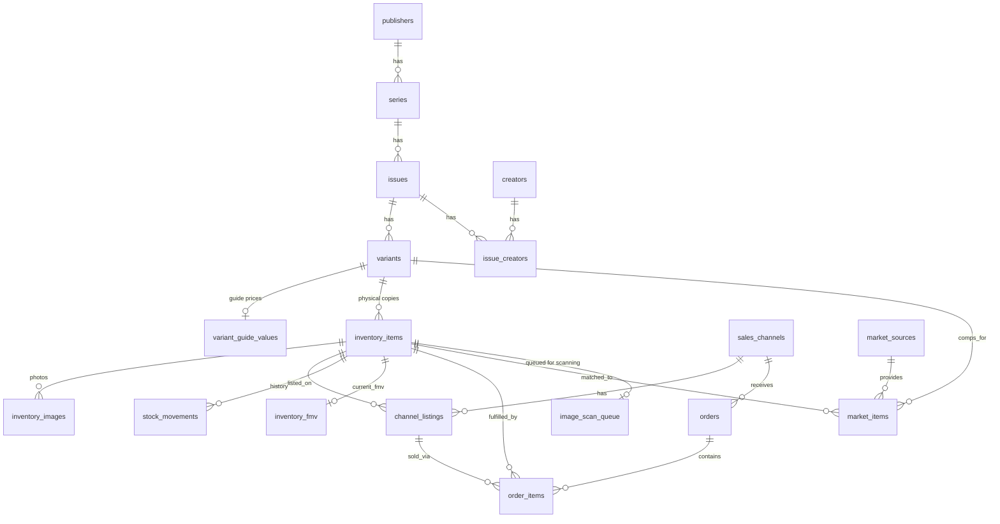

# New Multi-Channel Comic Inventory Schema — Design Explanation

**Source**: Your legacy Supabase Postgres dump (`comics_schema.dump`)  
**Goal**: Turn the flat, single-purpose `comics` table + GoCollect/eBay scrapers into a proper **inventory management system** that can sell the same physical comics on **eBay + Shopify** (and more) without double-selling.

**Schema location**: All new objects live in Postgres schema **`inventory`**. Legacy tables remain untouched in **`public`**.

YouTube / content marketing is out of scope until sales channels and image scanning are live.

---

## 1. What Was Wrong / Limiting in the Legacy Schema

| Legacy Problem | Impact |
|----------------|--------|
| Everything smashed into one flat `comics` table | Hard to query "all Amazing Spider-Man #1 variants", no proper uniqueness |
| `picture bytea` | Database bloat, slow backups, not CDN-friendly |
| No concept of **quantity available vs listed** | Cannot safely list the same book on eBay *and* Shopify |
| No real listings / orders tables | Sales history is only partial eBay sold comps |
| GoCollect data is scattered | Hard to maintain, lots of orphaned data |
| Free-text grades, publishers, creators | Typos, inconsistent reporting |
| No stock movement history | Cannot answer "why did quantity change?" or reverse a sale |
| Guide prices stored on every copy | A VG book carried NM/VF/F/VG/G/Fair columns that belong on the catalog |

---

## 2. High-Level Architecture

```
Catalog Layer (what the comic *is*)
  publishers → series → issues → variants
                              ↓
                     variant_guide_values
                              ↑
Physical Inventory Layer (what *you own*)
  inventory_items  ←→  stock_movements
       ↓
  inventory_images   (photos in object storage; URLs only in DB)
         ↑
Channel Layer (where you sell it)
  sales_channels → channel_listings → orders → order_items
         ↑
Market Data Layer (comps & FMV)
  market_sources → market_items
  inventory_fmv (current value for THIS copy/grade)
```

This cleanly separates:
- **Catalog** — reusable knowledge about comics
- **Your stock** — the actual books sitting in boxes
- **Listings & sales** — multi-channel
- **Market intelligence** — GoCollect / eBay solds

---

## 3. Table-by-Table Walkthrough & Mapping from Legacy

### Catalog

| New Table | Purpose | Maps from legacy |
|-----------|---------|------------------|
| `publishers` | Marvel, DC, Image… | `comics.publishing_company` |
| `series` | Amazing Spider-Man vol 2 | **`comics.title`** is the series name. **`comics.series`** is the run (`1`/`2`/`3`) → `series.volume`. Do **not** use `comics.volume` as the catalog volume (it is noisy DC 33–46 / `-`). |
| `issues` | #300, Annual 1, etc. | `comics.number` + publish date/year/month + cover_price |
| `creators` + `issue_creators` | Writer / penciller / inker / colorist / cover | `writer` → writer; `art` → penciller; `inks` → inker (if `inks` empty, copy penciller); `colors` → colorist (includes houses like Digital Chameleon). Cover artists parsed from `comments` (`Cover by X`, `X cover`) — not a general split of comments. Split lists on comma/`&`/`/`; keep `Jr.`/`Sr.` as one name. Unique on `lower(creators.name)`. |
| `variants` | Cover A, 1:25, Newsstand… | First ETL uses a single `'Standard'` variant. `comics.copy` is a **copy number** (`1`/`2`/`3`) → `inventory_items.copy_label`. Do not use GoCollect `variant_description` (unsafe join). |
| `variant_guide_values` | NM/VF/F/VG/G/Fair guide prices | `comics.near_mint_value` and siblings |

**ETL note:** `issues` is unique on `(series_id, number)`. Normalize `"1"`, `"#1"`, and `"01"` to the same value or you will get duplicates. Missing `series.volume` is stored as `''` (not NULL) so `UNIQUE (publisher_id, name, volume)` cannot insert two “no volume” rows.

### Physical Inventory

**`inventory_items`** — one row per physical copy. Replaces `public.comics` as the ownership record.

Key fields:
- `legacy_id` (unique) — `public.comics.id` so ETL and dual-run always have a map back
- `variant_id` — catalog link
- `copy_label` — `comics.copy` (copy number `1`/`2`/`3`, not a variant name)
- **Grading (do not force both styles)**
  - Raw: `grade_scale = 'raw'` + `grade` (Overstreet label)
  - Slabbed: `grade_scale` + `grade_numeric` + `certification_number`
- `location_code` — `comics.box` only (do not use `newbox`)
- `purchase_price` — cost of *this* copy
- Current market value for this copy/grade lives in **`inventory_fmv`**, not six guide columns on the row
- `status` is **physical only**: `in_stock`, `reserved`, `sold`, `damaged`, `lost`, `returned`, `archived`
- `quantity` defaults to 1; `reserved_quantity` is for multi-channel hold
- `primary_image_url` is a **cache**. Source of truth is `inventory_images`

**There is no `status = 'listed'`.** A book is listed if it has an active `channel_listings` row.

**`inventory_images`** — one row per photo.
- Files in object storage (Supabase Storage first). Only URLs/metadata in Postgres.
- Unique partial index: one primary image per item.
- Trigger keeps `primary_image_url` in sync, guarded with `pg_trigger_depth()` so clearing other primaries does not recurse.

### Multi-Channel Layer

| Table | Purpose |
|-------|---------|
| `sales_channels` | “eBay Main”, “Shopify Store”, etc. `config` is operational only — **never store API keys** |
| `channel_listings` | One row per listing of an inventory item on a channel. **This is the source of truth for “is it listed?”** |
| `orders` + `order_items` | Incoming sales. Link back to the exact copy that sold |
| `stock_movements` | Audit of every +1 / −1. The app (or a later trigger) must write these; nothing auto-logs yet |

**How multi-channel inventory works:**
1. One physical CGC 9.8 ASM #300 → one `inventory_items` row (`quantity = 1`, `status = 'in_stock'`).
2. List on eBay → `channel_listings` (`status = 'active'`). Optionally set `reserved_quantity = 1`.
3. List the same copy on Shopify → second `channel_listings` row.
4. Either channel sells it → `orders` / `order_items` + `stock_movements` type `sale` → `quantity = 0`, `status = 'sold'` → sync job ends the other listing.

Hard reserve (on list) or soft reserve (on paid order) both work. Pick one in the app and stick to it.

### Market Data

- `market_sources` + `market_items` replace the GoCollect / eBay-sold explosion.
- `inventory_fmv` is the current value for **this copy at its grade**.
- Guide prices for the *book* (any grade) live on `variant_guide_values`.
- Old request/response logging tables stay out of this schema.

### Staging

`staging_legacy_comics` still mirrors `public.comics` (including the old value columns) so the first ETL step is a straight insert.

---

## 4. Key Design Decisions & Trade-offs

| Decision | Why | Alternative considered |
|----------|-----|------------------------|
| UUID PKs + `legacy_id` | New system IDs + a stable map to `public.comics` | Integer PKs only |
| Physical status only | Stops `listed` drifting from `channel_listings` | Dual-write status + listings |
| Guide prices on the variant | Those numbers describe the book, not the copy | Keep six columns on every item |
| Grade styles not both required | CGC 9.4 does not map cleanly to Overstreet labels | Force enum + numeric |
| Soft deletes | Never lose sold/archived history | Hard deletes + archive tables |
| `quantity` default 1 | Unique copies now; lots later | Force quantity = 1 always |
| Images in object storage | No bytea, CDN-friendly | Keep pictures in Postgres |
| `primary_image_url` cache | Fast for queues/UI | Always join `inventory_images` |
| No `image_urls` jsonb | Would drift from `inventory_images` | Keep a json cache of all URLs |
| Backend-only grants | No PostgREST leak without RLS | Grant SELECT to `anon` |
| Numbered SQL + psycopg2 | Matches current stack | Alembic / SQLAlchemy |

---

## 5. How the Migration Would Look (high level)

1. Create the `inventory` schema with `poetry run inventory-migrate up` (session-mode connection — not the transaction pooler). **Done.**
2. Load `public.comics` into `inventory.staging_legacy_comics`.
3. ETL via `poetry run inventory-etl run` (**done** for the first load):
   - Upsert publishers / series / issues / Standard variants / creators / issue_creators
   - Put legacy NM/VF/… values onto `variant_guide_values`
   - One `inventory_items` row per legacy comic, **set `legacy_id`**
   - Map `public.comics_gocollect_fmv` → `inventory_fmv`
   - GoCollect variant names and eBay solds are **not** in this pass
4. Leave legacy app on `public`. It does **not** need `search_path` changes.
5. New scripts use `SET search_path TO inventory, public` (or qualified names).
6. Re-run `inventory-etl run` during dual-run. It does not overwrite `status` / quantities.

Compatibility view if you want a flat UI later:

```sql
CREATE VIEW inventory.ui_comics AS
SELECT
  i.id,
  i.legacy_id,
  p.name AS publishing_company,
  s.name AS series,
  iss.number,
  v.name AS variant,
  i.grade,
  i.grade_numeric,
  i.purchase_price,
  f.fmv,
  i.location_code AS box
FROM inventory.inventory_items i
JOIN inventory.variants v ON v.id = i.variant_id
JOIN inventory.issues iss ON iss.id = v.issue_id
JOIN inventory.series s ON s.id = iss.series_id
LEFT JOIN inventory.publishers p ON p.id = s.publisher_id
LEFT JOIN inventory.inventory_fmv f ON f.inventory_item_id = i.id
WHERE i.deleted_at IS NULL;
```

---

## 6. Dual Image-Scan Queues

Zero photos today. A single demand score would starve high-value books that have never been listed.

| Queue | View | Who is in it | Ranked by |
|-------|------|--------------|-----------|
| **Urgent listed** | `image_scan_urgent` | Active `channel_listings` **and** no rows in `inventory_images` | Recent views/watches, then value |
| **Value backlog** | `image_scan_value_backlog` | No photos **and** not currently live | `COALESCE(fmv, purchase_price)` + grade |

Missing photos = `NOT EXISTS` on `inventory_images` (not `primary_image_url IS NULL`).

`image_scan_queue` is one row per item. Re-scan updates that row. If both enqueue scripts collide, **urgent wins**:

```sql
INSERT INTO inventory.image_scan_queue (inventory_item_id, queue_type, priority_score, enqueued_from)
SELECT inventory_item_id, 'urgent_listed', demand_score, 'image_scan_urgent'
FROM inventory.image_scan_urgent
ORDER BY demand_score DESC
LIMIT 30
ON CONFLICT (inventory_item_id) DO UPDATE
  SET queue_type = 'urgent_listed',
      priority_score = EXCLUDED.priority_score,
      updated_at = now();

INSERT INTO inventory.image_scan_queue (inventory_item_id, queue_type, priority_score, enqueued_from)
SELECT inventory_item_id, 'value_backlog', value_score, 'image_scan_value_backlog'
FROM inventory.image_scan_value_backlog
WHERE inventory_item_id NOT IN (
    SELECT inventory_item_id FROM inventory.image_scan_queue
    WHERE queue_type = 'urgent_listed'
)
ORDER BY value_score DESC
LIMIT 30
ON CONFLICT (inventory_item_id) DO UPDATE
  SET queue_type = CASE
        WHEN image_scan_queue.queue_type = 'urgent_listed' THEN 'urgent_listed'
        ELSE EXCLUDED.queue_type
      END,
      priority_score = CASE
        WHEN image_scan_queue.queue_type = 'urgent_listed'
          THEN image_scan_queue.priority_score
        ELSE EXCLUDED.priority_score
      END,
      updated_at = now();
```

Work from `image_scan_worklist`. **Repeat `ORDER BY` in the query** — view `ORDER BY` is not guaranteed:

```sql
SELECT * FROM inventory.image_scan_worklist
ORDER BY
  CASE queue_type WHEN 'urgent_listed' THEN 1 ELSE 2 END,
  COALESCE(rank_hint, 999999),
  priority_score DESC NULLS LAST;
```

Optional: also order by `location_code` when pulling boxes.

---

## 7. Images & Storage

- **Start:** Supabase Storage, path `comic-images/{inventory_item_id}/01.webp`
- **Scale later:** Cloudflare R2 if egress becomes a problem
- **Never:** `bytea` in Postgres

Rough size for ~4,000 primaries + 2–3 extras on ~1,000 high-value books: **~8–14 GB**. On Supabase Pro (100 GB included) storage cost is effectively **$0**.

---

## 8. How to Run / Connect

Migrations are **numbered SQL files + a small psycopg2 runner** (Alembic-like, no SQLAlchemy).

```
src/comic_inventory/migrate.py
src/comic_inventory/etl.py
migrations/0001_inventory_schema.sql
migrations/0002_row_level_security.sql
```

The runner records applied versions in `public.schema_migrations` and applies each file in its own transaction.

```bash
# Session-mode pooler (port 5432) or direct — NOT :6543
export DATABASE_URL='postgresql://postgres.<ref>:<pw>@aws-0-<region>.pooler.supabase.com:5432/postgres?sslmode=require'
poetry run inventory-migrate status
poetry run inventory-migrate up
poetry run inventory-etl status
poetry run inventory-etl run
```

Rules:
- New schema changes go in `migrations/0003_whatever.sql`, never by editing an already-applied file.
- ETL is `poetry run inventory-etl`, not a numbered migration.
- **Do not** add `inventory` to Exposed schemas until an `inventory.operators` row exists.
- New app/ETL: `SET search_path TO inventory, public;` or qualified names.
- Legacy psycopg2 code keeps using `public` with no change.

---

## 9. Current Scope

```
inventory.Catalog
  publishers → series → issues → variants + creators
  variant_guide_values
inventory.Physical
  inventory_items (legacy_id) ←→ stock_movements
  inventory_images
inventory.Channels
  sales_channels → channel_listings → orders / order_items
inventory.Market
  market_sources → market_items / inventory_fmv
inventory.Scan queues
  listing_view_events / listing_view_daily
  image_scan_urgent / image_scan_value_backlog
  image_scan_queue + image_scan_worklist
inventory.Staging
  staging_legacy_comics
```

### Explicitly deferred
- YouTube / content layer
- Normalized `locations` table
- Listing sync fields (`last_synced_at`, `sync_status`)
- Item-level fee/profit columns
- Auto-writing `stock_movements` via trigger
- Alembic (replaced by poetry run inventory-migrate)

---

## 10. Suggested Stand-up Sequence

1. Review this tightened SQL (done).
2. Create `inventory` with `poetry run inventory-migrate up` (session-mode connection). (done)
3. ETL catalog + `inventory_items` (set `legacy_id`) + FMV. Old app stays on `public`. (done — `poetry run inventory-etl run`)
4. Images + scan queue.
5. Listings / orders when you sell on two channels.

---

## ER Overview


